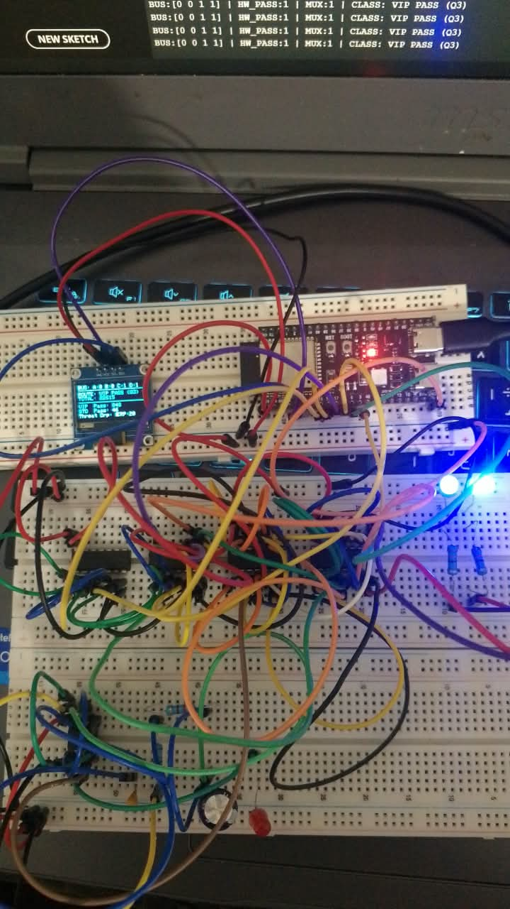

# Hardware-Accelerated Network Packet Filtering Engine & Pipeline Priority Scheduler




---

## 📌 Document Metadata & Context

* **Document Ref:** HW-NET-2026-V4
* **Status:** Approved for Prototyping
* **Author:** Senior Network Hardware Architect
* **Original Specification Source:** CISCO SYSTEMS / EMBEDDED SYSTEMS ARCHITECTURE DIVISION

---

## 🏢 Engineering Assignment & Real-World Context

In enterprise networking switches and 5G core infrastructure, software-based packet inspection (using CPU loops) creates severe latency bottlenecks. Next-generation routers utilize dedicated hardware logic pipelines (ASICs/FPGAs) to evaluate security flags and route priority in parallel within nanoseconds.

This project implements a hardware-accelerated network packet filtering co-processor prototype. It pairs an ESP32 host with discrete digital logic gate synthesis (Karnaugh map reduced boolean expressions), 74HC74 D Flip-Flop hardware pipeline registers, and 74HC153 Multiplexer priority routing coupled with real-time I2C telemetry.

---

## 🏗️ System Architecture & Functional Domains

The System is divided into three functional domains:

```
                  +---------------------------------------+
                  | ESP32 Traffic Generator (Core 0)      |
                  |  - Signal A (Malware Flag)            |
                  |  - Signal B (SYN-Flood Flag)          |
                  |  - Signal C (VIP Priority Select)     |
                  |  - Signal D (Valid CRC/Checksum)      |
                  |                                       |
                  +-------------------+-------------------+
                                      |
                                      v
                  +---------------------------------------+
                  | Hardware Combinational Logic          |
                  |  - 74HC08 AND Gates                   |
                  |  - Evaluates: F_pass = A' · B' · D    |
                  +-------------------+-------------------+
                                      |
                                      v
                  +---------------------------------------+
                  | Pipeline Register Stage               |
                  |  - 74HC74 D Flip-Flop                  |
                  |  - Glitch Suppression & Sync          |
                  +-------------------+-------------------+
                                      |
                                      v
                  +---------------------------------------+
                  | Hardware Priority Scheduler           |
                  |  - 74HC153 4:1 Multiplexer            |
                  |  - Queue Routing: VIP / Std / Drop    |
                  +-------------------+-------------------+
                                      |
                                      v
                  +---------------------------------------+
                  | Telemetry & Visualizer (Core 1)       |
                  |  - 0.96" SSD1306 OLED                 |
                  |  - Real-Time PPS, Pass/Drop %         |
                  +---------------------------------------+
```

### Subsystem Breakdown

* **Traffic Generator & Bus Master (ESP32 Core 0):** Emulates high-speed packet header arrival by driving 4 digital output lines representing security and operational header bits (`A`, `B`, `C`, `D`) alongside a dedicated system clock (`CLK`).
* **Hardware Gating & Register Stage (Discrete Logic):** Evaluates packet validity and security threats instantaneously via boolean gating logic. Outputs are registered into a 74HC74 D Flip-Flop pipeline stage to prevent glitch propagation to downstream routing networks.
* **Hardware Priority Scheduler (Multiplexer Stage):** Uses a 74HC153 Multiplexer driven by priority select signals to dynamically map valid packets to High-Priority VIP Queues or Standard Queues while grounding dropped/quarantined packet streams.
* **Telemetry & OLED Visualizer (ESP32 Core 1):** Reads latched hardware status flags, calculates real-time metrics (Packets Per Second, Pass/Drop %, Active Threat Alerts), and updates a low-latency 0.96" I2C OLED display driver.

---

## 🛠️ Hardware Bill of Materials (BOM)

| Component Name | IC Part Number | Quantity | Functional Role in Circuit |
| :--- | :--- | :---: | :--- |
| **ESP32 Microcontroller** | ESP32-WROOM-32 | 1 Unit | Traffic Generator (Core 0), System Clock Generator, Telemetry & I2C Display Manager (Core 1) |
| **OLED Display Module** | 0.96" SSD1306 (I2C) | 1 Unit | Real-time Telemetry Dashboard (Displays Throughput, Drop Rates, Priority Queue Status) |
| **Quad 2-Input AND Gate** | 74HC08 / 74LS08 | 1 IC | Synthesizes boolean decision function $F_{pass} = A' \cdot B' \cdot D$ |
| **Dual D Flip-Flop IC** | 74HC74 | 1 IC | Acts as 1-stage Pipeline Register to synchronize Pass/Drop flags with system clock |
| **Dual 4-to-1 Multiplexer** | 74HC153 / 74LS153 | 1 IC | Hardware Priority Queue Selector (Routes data to Queue 3 VIP, Queue 1 Standard, or Drop) |

---

## 📊 Digital Logic Synthesis & Truth Table

### Control Header Bit Definitions
* **`A`**: Malware Signature Detected
* **`B`**: SYN-Flood Attack Pattern
* **`C`**: VIP Class of Service
* **`D`**: Valid CRC/Parity Checksum

| A (Malware) | B (SYN-Flood) | C (VIP) | D (Checksum) | F_drop | F_pass | P1 (Pri 1) | P0 (Pri 0) | Hardware Action State |
| :-: | :-: | :-: | :-: | :-: | :-: | :-: | :-: | :--- |
| 0 | 0 | 0 | 0 | 1 | 0 | 0 | 0 | **DROP** (Corrupt Standard Header) |
| 0 | 0 | 0 | 1 | 0 | 1 | 0 | 1 | **PASS** (Standard Queue 1) |
| 0 | 0 | 1 | 0 | 1 | 0 | 0 | 0 | **DROP** (Corrupt VIP Header) |
| 0 | 0 | 1 | 1 | 0 | 1 | 1 | 1 | **PASS** (High-Priority Queue 3 VIP) |
| 0 | 1 | 0 | 0 | 1 | 0 | 0 | 0 | **DROP** (Corrupt + SYN-Flood) |
| 0 | 1 | 0 | 1 | 1 | 0 | 0 | 0 | **DROP** (SYN-Flood Attack Detected) |
| 0 | 1 | 1 | 0 | 1 | 0 | 0 | 0 | **DROP** (Corrupt VIP + SYN-Flood) |
| 0 | 1 | 1 | 1 | 1 | 0 | 0 | 0 | **DROP** (Blocked SYN-Flood VIP) |
| 1 | 0 | 0 | 0 | 1 | 0 | 0 | 0 | **DROP** (Corrupt + Malware) |
| 1 | 0 | 0 | 1 | 1 | 0 | 0 | 0 | **DROP** (Malware Signature Flagged) |
| 1 | 0 | 1 | 0 | 1 | 0 | 0 | 0 | **DROP** (Corrupt VIP + Malware) |
| 1 | 0 | 1 | 1 | 1 | 0 | 0 | 0 | **DROP** (Blocked Malware VIP) |
| 1 | 1 | 0 | 0 | 1 | 0 | 0 | 0 | **DROP** (Multi-Threat Vector) |
| 1 | 1 | 0 | 1 | 1 | 0 | 0 | 0 | **DROP** (Multi-Threat Vector) |
| 1 | 1 | 1 | 0 | 1 | 0 | 0 | 0 | **DROP** (Multi-Threat Vector) |
| 1 | 1 | 1 | 1 | 1 | 0 | 0 | 0 | **DROP** (Multi-Threat Vector) |

### Karnaugh Map (K-Map) Reduction & Boolean Equations

Applying Boolean algebraic reduction and Karnaugh Mapping yields the optimized gate equations executed by the discrete hardware layer:

1. **Pass Decision Line ($F_{pass}$):** $F_{pass} = A' \cdot B' \cdot D$
2. **Drop Decision Line ($F_{drop}$):** $F_{drop} = (F_{pass})' = A + B + D'$
3. **Priority Bit 1 Selection ($P_1$):** $P_1 = F_{pass} \cdot C = A' \cdot B' \cdot C \cdot D$
4. **Priority Bit 0 Selection ($P_0$):** $P_0 = F_{pass} = A' \cdot B' \cdot D$

---

## 🔌 Pinout Wiring Guide & Interconnect Mapping

Follow this exact physical pin layout to bridge the ESP32 host, 74xx logic gates, D Flip-Flop registers, 4:1 Multiplexer, and OLED visualizer.

| Source Device & Pin | Target Device & Pin | Signal Name | Description |
| :--- | :--- | :--- | :--- |
| **ESP32 GPIO 16** | 74HC08 Pin 1 (1A) | `Signal A` | Malware Header Flag Bus Line |
| **ESP32 GPIO 17** | 74HC08 Pin 2 (1B) | `Signal B` | SYN-Flood Flag Bus Line |
| **ESP32 GPIO 18** | 74HC153 Pin 14 (S1) | `Signal C` | VIP Class Select Line to MUX |
| **ESP32 GPIO 19** | 74HC08 Pin 4 (2A) | `Signal D` | Valid Checksum Flag Bus Line |
| **74HC08 Output (Pin 6)** | 74HC74 Pin 2 (1D) | `F_pass_raw` | Combinational Pass Result to D Flip-Flop Input |
| **74HC74 Output Pin 5 (1Q)** | ESP32 GPIO 21 & 74HC153 S0 | `Q_pass (Latched)` | Latched Pass Flag fed back to ESP32 & MUX Select S0 |
| **74HC153 Output Pin 7 (1Y)** | ESP32 GPIO 22 | `MUX_OUT` | Hardware Queue Route Feedback Signal |
| **ESP32 GPIO 21 (SDA)** | OLED SDA Pin | `I2C Data` | I2C Serial Data line for OLED Display |
| **ESP32 GPIO 22 (SCL)** | OLED SCL Pin | `I2C Clock` | I2C Serial Clock line for OLED Display |

---

## 🤝 Contributing Guidelines

We welcome hardware engineer and software maintainer contributions to improve filtering throughput, optimize gate count, or expand HDL coverage.

### Contribution Process

1. **Repository Branching:** Fork the repository and check out a dedicated feature branch using the standard engineering naming syntax: `feature/architecture-component` or `bugfix/issue-description`.
2. **Schematic & Hardware Verification:** Any modification to discrete logic ICs, GPIO pin maps, or K-Map boolean reductions must include updated simulation traces (e.g., Logisim, LTspice, or KiCad schematic source files).
3. **Firmware Constraints:** ESP32 code contributions must maintain hard real-time execution boundaries. Core 0 is strictly reserved for hardware signal synthesis, and Core 1 is designated for OLED I2C telemetry rendering.
4. **Pull Request Validation:** Submit pull requests against the `main` development branch. All PRs require review from at least one hardware maintainer and must pass automated syntax validation for firmware components.

---

## 📜 License

This project is licensed under the **GNU Affero General Public License v3.0 (AGPL-3.0)** - see the [LICENSE](LICENSE) file for details.

### Copyleft Summary
* **Open Source Requirement:** Any modification, distribution, or derivative work **must** be made publicly available under the AGPLv3 license.
* **Network Execution / Cloud Protection:** If you run a modified version of this software or firmware on a network/cloud service, you **must** make the complete source code accessible to all users interacting with that service.
* **Non-Proprietary:** Closed-source or proprietary commercial bundling is strictly prohibited under this license.
